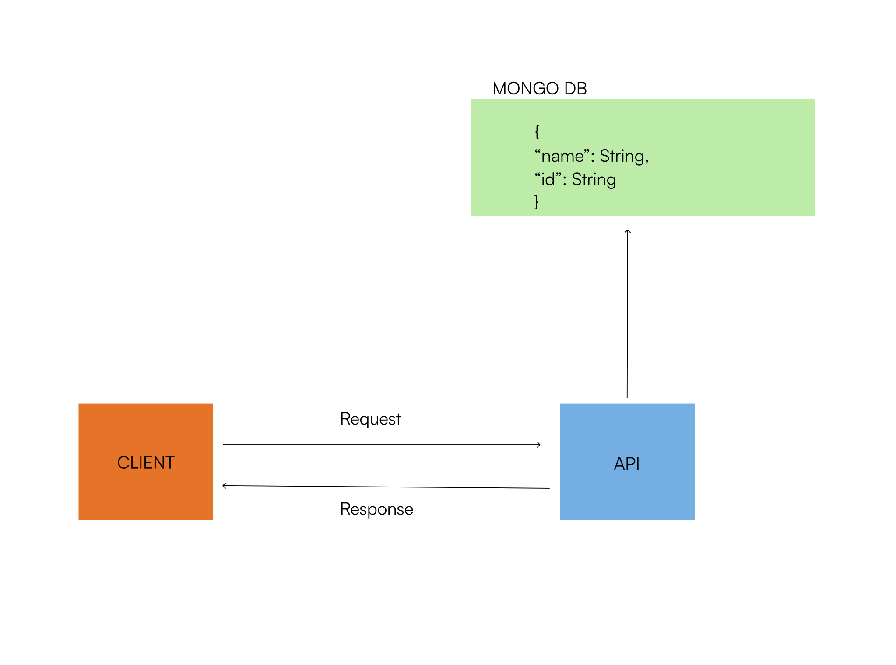

## API Documentation of the task

### A guide to consuming this project



This backend project is created to serve an A.P.I using the R.E.S.T protocool. Connected to the mongo database, this service allows users to make C.R.U.D operations and here's how:

<br>

> ### Creating a user

- <b>Method</b>
  POST

  <br>

- <b>URL</b>
  https://hngx-stage2.onrender.com/api

<br>

- <b>Body</b>

```

 {
    name: String
 }
```
It will check if the name already exists, if it is a string and if it is not empty then

If the name is not already in use, you should get the name and an id as successful response.

```
// Example response

{
    name: "Matthew",
    id: "64fe1a06ef2f7757e645289a"
}
```

<br>
<br>

<br>

> ### Reading a user with a yser id

- <b>Method</b>
  GET

  <br>

- <b>URL</b>
  https://hngx-stage2.onrender.com/api/id

If the id exists, you should get the name and id as successful response.

```
// Example response

{
    name: "Matthew",
    id: "64fe1a06ef2f7757e645289a"
}
```

<br>
<br>

> ### Updating a user

- <b>Method</b>
  PATCH

  <br>

- <b>URL</b>
  https://hngx-stage2.onrender.com/api/valid_user_id

 <br>

- <b>Body</b>

```
{
  updaetDetails:String
}
```

If the id exists and the new name isn't taken already, you should get the name and id as successfull response.

```
 // Example response

{
    name: "Mat",
    id: "64fe1a06ef2f7757e645289a"
}
```

<br>
<br>

> ### Deleting a user

- <b>Method</b>
  DELETE

  <br>

- <b>URL</b>
  https://hngx-stage2.onrender.com/api/valid_user_id

<br>

If the id exists, you should get a successful response.

```
// Example response

{
    message: "User with the id :64fe1a06ef2f7757e645289a has been deleted successfully",
}
```

<br>
<br>

### Note :bangbang:

- All values sent are trimmed.
- When there is an error, a detailed reason would be sent in the message property of the response object

```
Example error

{
    message: "No user was found with this name!"
}
```

<br>

Find out how to run this on your machine [here](./README.md)